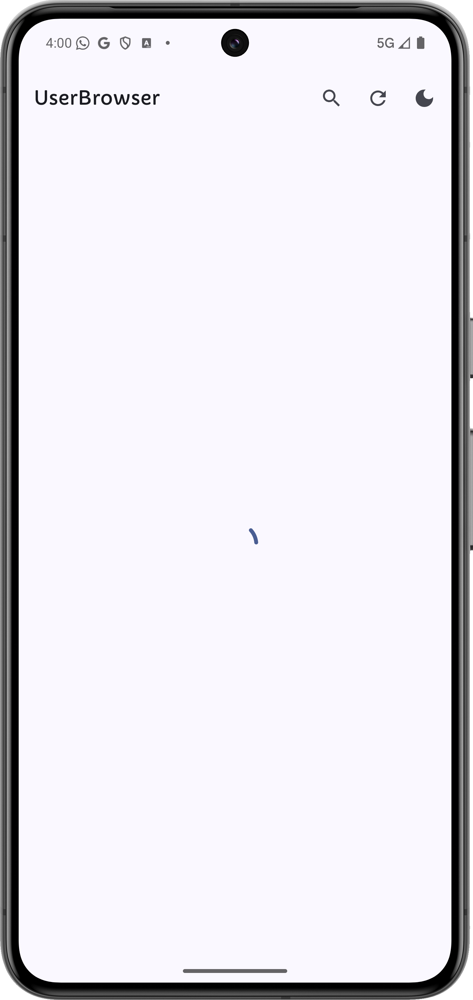
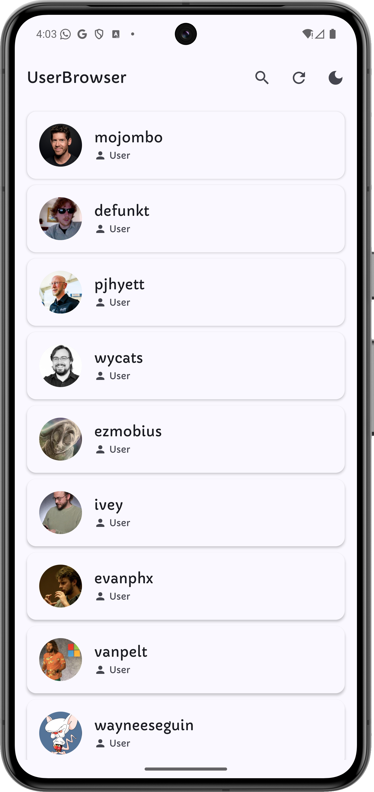
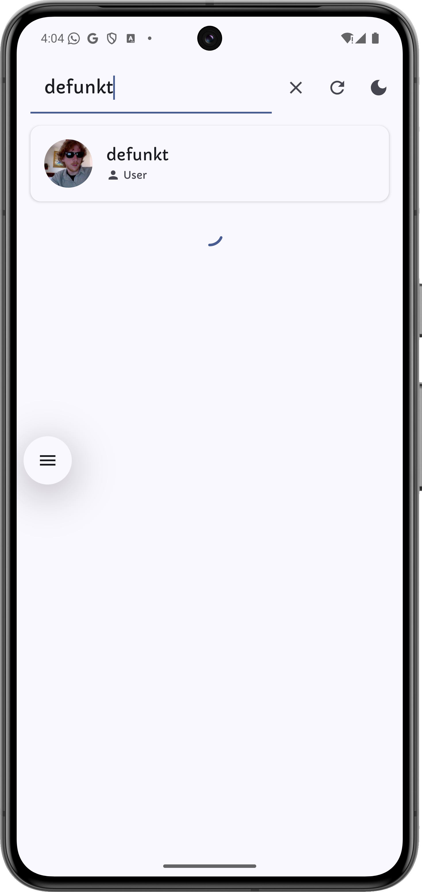
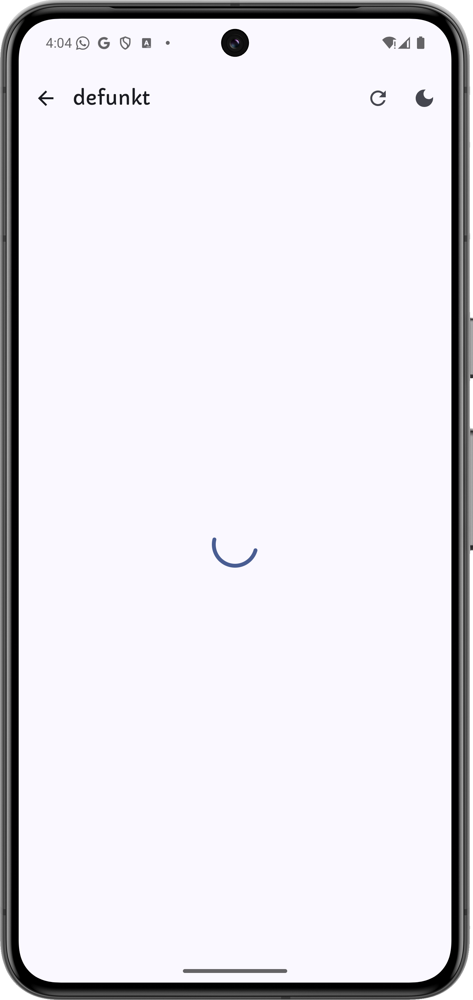
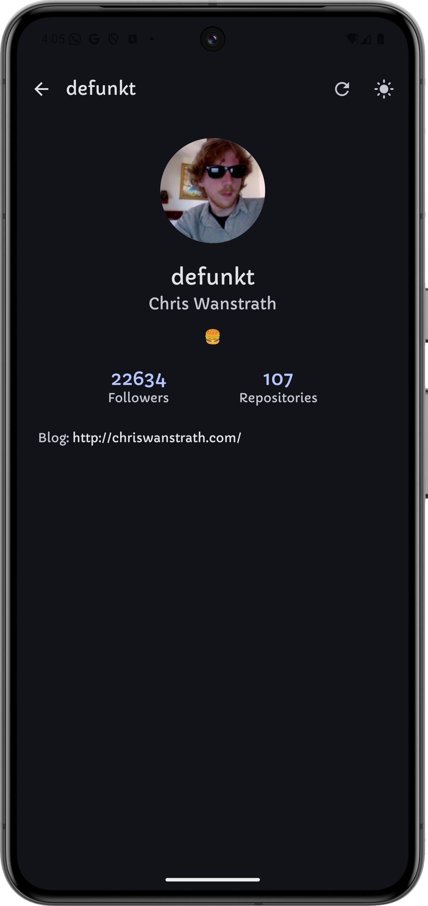
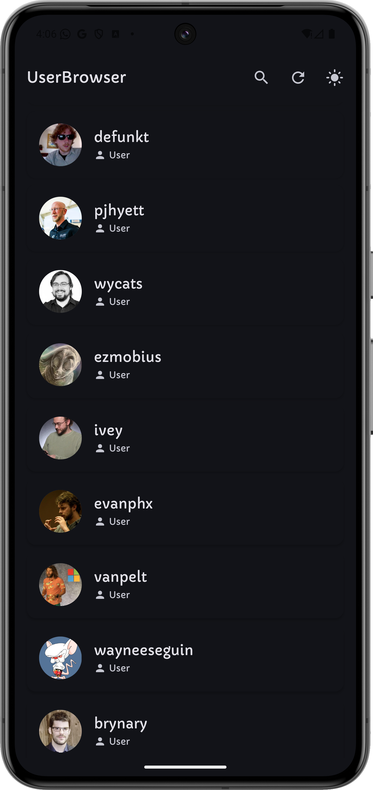

# GithubUserBrowser
An application that fetches and displays public GitHub users using the GitHub API.

## Screenshots

here

<table>
<tr>
<th></th>
<th></th>
<th></th>
<th></th>
</tr>

<tr>
<th>UserList Screen</th>
<th>UserList Search</th>
<th>User Search</th>
<th>User Detail Screen</th>
</tr>

<tr>
<th></th>
<th></th>
<th></th>
</tr>

<tr>
<th>User Detail Screen</th>
<th>User Detail Screen</th>
<th>User List Screen</th>
</tr>

</table>

## How to build and run the app
- clone the repo
- Prerequisites: Android Studio (latest stable), JDK 17, Android SDK 36.
- Open the project in Android Studio and let Gradle sync.
- Run on a device/emulator via the Run button.
- Optional CLI:
  - Build Debug: `./gradlew assembleDebug`

## Architecture overview
- Clean Architecture + MVVM with three layers:
  - Presentation: Jetpack Compose screens, ViewModels (StateFlow), Navigation3 for navigation, Material3 components, pull-to-refresh.
  - Domain: Use cases (`GetUsers`, `GetUserDetail`, `SearchUsers`, `ClearCache`), domain models (`User`, `UserDetail`), repository interface.
  - Data: Retrofit + OkHttp + Kotlinx Serialization (remote), Room (local, offline-first), DataStore (theme persistence), DTOs and mappers, repository implementation.
- Concurrency: Kotlin Coroutines + Flow.
- DI: Hilt with scoped bindings for API, DB, Repository, and ViewModels.
- Pagination: Cursor based using GitHub `since` with load more near list end.
- Search: GitHub search API with offline fallback (filters cached users when offline or rate limited).

## Key design decisions and trade-offs
- Used Jetpack Compose because it simplifies UI state handling and integrates cleanly with Kotlin, making the app more maintainable.
- intentionally kept animations and advanced UI polish minimal to prioritize clarity and maintainability.
- Navigation3 for a Compose first, type safe, backstack driven API (trade-off: newer API surface).
- Offline-first: Room caches network responses; UI remains usable offline; search falls back to cached filtering.
- State management: StateFlow + sealed UI states (loading, success, error, empty, pagination loading).
- Error handling: HTTP 403 (rate limit) mapped to a friendly message with cache fallback.
- Theming: Dark mode toggle persisted with DataStore (simple boolean preference).
- Simplicity: Single module app and minimal animations to prioritize architecture clarity.

## Known limitations / improvements
- Add unit and UI tests (ViewModels, use cases, repository, and key UI flows).
